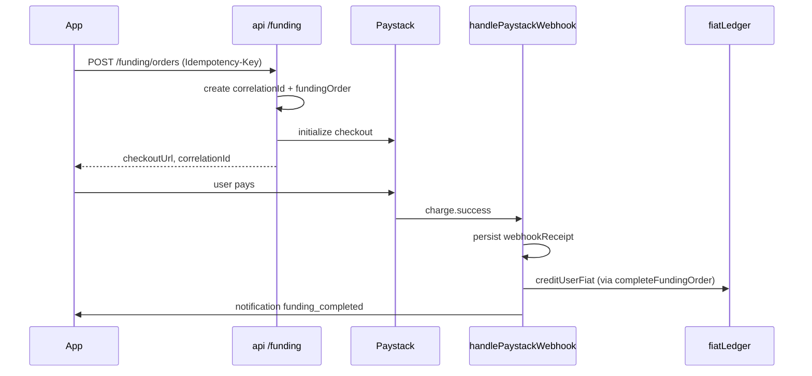
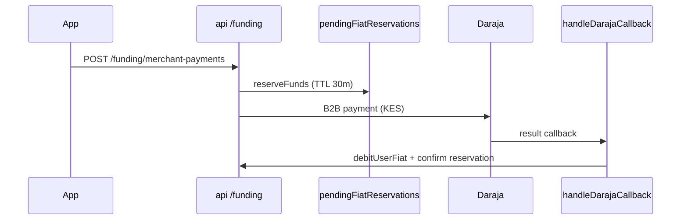

# Payment Lifecycle — Tourist Payments

End-to-end flow for funding (Paystack → USD wallet) and settlement (USD → KES via Daraja).

## Correlation ID

Every funding order receives a `correlationId` at creation. Clients may pass `X-Correlation-Id`; otherwise the server generates `corr_<uuid>`. The ID propagates through:

- `fundingOrders.correlationId`
- `fundingOrders/{id}/timeline/*`
- `webhookReceipts.correlationId`
- `merchantPayments.correlationId`
- Structured logs (`paymentOpsLogger`)

## Funding Flow

## Settlement Flow

## Reconciliation

| Job | Schedule | Purpose |
|-----|----------|---------|
| `reconcileFundingOrders` | Every 15 min | Provider recovery — verify stale pending orders |
| `reconcileWalletIntegrity` | Daily 03:00 UTC | Read-only users.usdBalance vs fiatLedger check |
| `releaseExpiredReservations` | Every 10 min | Release expired fiat holds |
| `retrySettlementJobs` | Every 5 min | Retry processing Daraja settlement jobs |

## Idempotency

- **Funding:** `Idempotency-Key` header (24h TTL in `fundingIdempotencyKeys`)
- **Webhooks:** `webhookReceipts` persisted before processing
- **Merchant payments:** `requestId` field (reservation key `fres_{requestId}`)

## Admin Ops

Mounted on `api` (admin Bearer token required):

- `GET /funding/ops/audit/:correlationId`
- `GET /funding/ops/metrics/daily?date=YYYY-MM-DD`
- `GET /funding/ops/timeline/:fundingOrderId`
