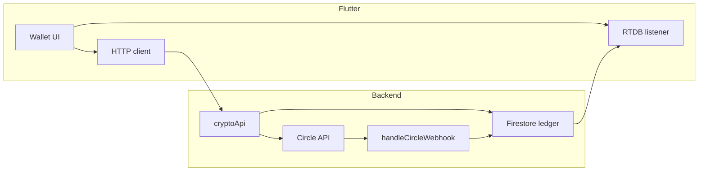
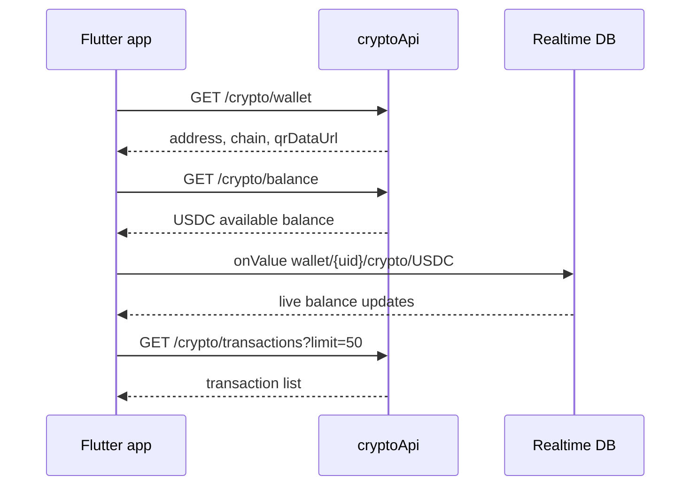
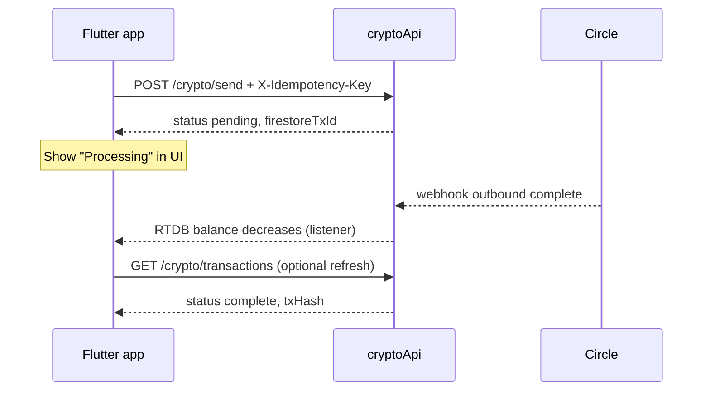

# Circle USDC Wallet — Flutter (C2B) Implementation Guide

Guide for the **consumer mobile app** team to integrate Circle USDC wallets. The backend owns all Circle credentials, ledger math, and webhooks. The app only needs Firebase Auth, four REST endpoints, and an optional Realtime Database listener.

For backend internals, see [`CIRCLE.md`](./CIRCLE.md).

---

## What you are building

| Screen / feature | Backend source |
|------------------|----------------|
| USDC wallet home (balance) | `GET /crypto/balance` + RTDB `wallet/{uid}/crypto/USDC` |
| Receive / deposit (address + QR) | `GET /crypto/wallet` |
| Transaction history | `GET /crypto/transactions` |
| Send USDC | `POST /crypto/send` |

USDC is **separate from fiat** (KES, NGN, GHS). Do not use `users.cryptoBalance` or legacy USDT RTDB paths for Circle USDC.

---

## Base URL

| Environment | Base URL |
|-------------|----------|
| **Production** | `https://us-central1-truepay-72060.cloudfunctions.net/cryptoApi` |
| **Emulator** | `http://localhost:5001/truepay-72060/us-central1/cryptoApi` |
| **Android emulator → host machine** | `http://10.0.2.2:5001/truepay-72060/us-central1/cryptoApi` |

All paths below are relative to this base (e.g. `GET /crypto/wallet` → `{base}/crypto/wallet`).

---

## Authentication

Every request requires a fresh Firebase ID token:

```http
Authorization: Bearer <firebase-id-token>
Content-Type: application/json
```

**Flutter pattern**

```dart
import 'package:firebase_auth/firebase_auth.dart';

Future<String> requireIdToken() async {
  final user = FirebaseAuth.instance.currentUser;
  if (user == null) throw Exception('Not signed in');
  final token = await user.getIdToken(); // force refresh if needed: getIdToken(true)
  if (token == null || token.isEmpty) throw Exception('Missing ID token');
  return token;
}
```

On `401`, sign the user out or refresh the token and retry once.

---

## Recommended packages

```yaml
dependencies:
  firebase_auth: ^5.x
  firebase_database: ^11.x   # RTDB balance listener (optional but recommended)
  http: ^1.x                 # or dio
  uuid: ^4.x                 # X-Idempotency-Key for sends
```

---

## Architecture (app view)



**Rules for the client**

1. **Balances for send validation** — use `GET /crypto/balance` (available = ledger minus pending sends).
2. **Live balance display** — listen to RTDB `wallet/{uid}/crypto/USDC` for instant updates after deposits/sends complete.
3. **Never compute balance locally** from transaction history; history is for display only.
4. **Send is async** — `POST /crypto/send` returns `status: "pending"` immediately; completion arrives via webhook (seconds to minutes).

---

## User lifecycle

### 1. Signup / first open

When a `users/{userId}` document is created, the backend trigger (`onUserCreated`) provisions a Circle wallet automatically if Circle is configured. **No extra client call is required on signup.**

If provisioning failed (rare), the first `GET /crypto/wallet` creates the wallet on demand.

### 2. Open wallet screen



### 3. Receive USDC (deposit)

1. Show deposit address and QR from `GET /crypto/wallet`.
2. User sends USDC on-chain from an external wallet to that address.
3. Backend receives Circle webhook → credits ledger → updates RTDB.
4. App sees balance increase via RTDB listener (or on next `GET /crypto/balance`).

**Display the `chain` field** (e.g. `BASE` in production, testnet label in sandbox) so users send on the correct network.

### 4. Send USDC



---

## API reference

### `GET /crypto/wallet`

Deposit address and QR payload.

**Response `200`**

```json
{
  "success": true,
  "data": {
    "address": "0x...",
    "chain": "BASE",
    "asset": "USDC",
    "walletId": "circle-wallet-uuid",
    "qrDataUrl": "data:image/png;base64,...",
    "qrPayload": "0x..."
  }
}
```

| Field | Use in UI |
|-------|-----------|
| `address` | Copy button, share sheet |
| `chain` | Network warning banner |
| `qrDataUrl` | Display QR image directly |
| `qrPayload` | Or generate QR locally with `qr_flutter` |

**Errors:** `401` unauthorized, `404` wallet not found (Circle not configured), `500` server error.

---

### `GET /crypto/balance`

Spendable USDC (ledger balance minus active send reservations).

**Response `200`**

```json
{
  "success": true,
  "data": {
    "USDC": 12.5,
    "asset": "USDC"
  }
}
```

Call before showing send confirmation and before enabling the send button.

---

### `GET /crypto/transactions`

**Query:** `limit` (optional, default `50`, max `100`).

**Response `200`**

```json
{
  "success": true,
  "data": {
    "transactions": [
      {
        "id": "firestore-doc-id",
        "type": "deposit",
        "amount": 5,
        "asset": "USDC",
        "status": "complete",
        "txHash": "0x...",
        "circleTransactionId": "...",
        "toAddress": null,
        "fromWalletId": null,
        "createdAt": "2026-06-07T12:00:00.000Z"
      }
    ]
  }
}
```

**Transaction types:** `deposit`, `send`.

**Statuses**

| `status` | Meaning | UI |
|----------|---------|-----|
| `complete` | Settled on-chain | Show checkmark, link `txHash` to explorer if present |
| `pending` | Send in flight | Spinner, "Processing" |
| `failed` | Circle rejected send | Error state, funds released back to available balance |

Pull-to-refresh or poll every few seconds while any row is `pending`.

---

### `POST /crypto/send`

**Headers**

```http
Authorization: Bearer <token>
Content-Type: application/json
X-Idempotency-Key: <uuid-v4>
```

**Body**

```json
{
  "toAddress": "0xRecipientAddress",
  "amount": 5
}
```

`amount` is a positive number in USDC (not wei).

**Response `200` (immediate)**

```json
{
  "success": true,
  "data": {
    "success": true,
    "circleTransactionId": "...",
    "txHash": null,
    "status": "pending",
    "firestoreTxId": "...",
    "reservationId": "res_...",
    "amount": 5
  }
}
```

**Error codes**

| HTTP | When | Client action |
|------|------|---------------|
| `400` | Missing fields, missing idempotency key, insufficient balance | Show validation message |
| `401` | Bad/missing token | Re-auth |
| `404` | No wallet | Call `GET /crypto/wallet` first |
| `409` | Same idempotency key still in progress | Wait, then retry with **same** key |
| `429` | >5 sends per minute per user | Disable send, show cooldown |
| `500` | Server/Circle error | Retry with **same** idempotency key |

**Idempotency:** Generate one `Uuid().v4()` per user tap on "Confirm send". Reuse the **same** key on network retries until you get `200` or a final `400`. Never generate a new key for the same user action.

---

## Flutter service example

```dart
import 'dart:convert';
import 'package:http/http.dart' as http;
import 'package:uuid/uuid.dart';

class CryptoApiClient {
  CryptoApiClient({
    required this.baseUrl,
    required this.getIdToken,
    http.Client? httpClient,
  }) : _http = httpClient ?? http.Client();

  final String baseUrl;
  final Future<String> Function() getIdToken;
  final http.Client _http;

  Future<Map<String, String>> _headers({String? idempotencyKey}) async {
    final headers = {
      'Authorization': 'Bearer ${await getIdToken()}',
      'Content-Type': 'application/json',
    };
    if (idempotencyKey != null) {
      headers['X-Idempotency-Key'] = idempotencyKey;
    }
    return headers;
  }

  Future<CryptoWallet> getWallet() async {
    final res = await _http.get(
      Uri.parse('$baseUrl/crypto/wallet'),
      headers: await _headers(),
    );
    final body = jsonDecode(res.body) as Map<String, dynamic>;
    if (res.statusCode != 200 || body['success'] != true) {
      throw CryptoApiException(res.statusCode, body['error']?.toString());
    }
    return CryptoWallet.fromJson(body['data'] as Map<String, dynamic>);
  }

  Future<double> getBalance() async {
    final res = await _http.get(
      Uri.parse('$baseUrl/crypto/balance'),
      headers: await _headers(),
    );
    final body = jsonDecode(res.body) as Map<String, dynamic>;
    if (res.statusCode != 200 || body['success'] != true) {
      throw CryptoApiException(res.statusCode, body['error']?.toString());
    }
    return (body['data']['USDC'] as num).toDouble();
  }

  Future<List<CryptoTransaction>> getTransactions({int limit = 50}) async {
    final res = await _http.get(
      Uri.parse('$baseUrl/crypto/transactions?limit=$limit'),
      headers: await _headers(),
    );
    final body = jsonDecode(res.body) as Map<String, dynamic>;
    if (res.statusCode != 200 || body['success'] != true) {
      throw CryptoApiException(res.statusCode, body['error']?.toString());
    }
    final list = body['data']['transactions'] as List<dynamic>;
    return list
        .map((e) => CryptoTransaction.fromJson(e as Map<String, dynamic>))
        .toList();
  }

  Future<SendResult> sendUsdc({
    required String toAddress,
    required double amount,
    required String idempotencyKey,
  }) async {
    final res = await _http.post(
      Uri.parse('$baseUrl/crypto/send'),
      headers: await _headers(idempotencyKey: idempotencyKey),
      body: jsonEncode({'toAddress': toAddress, 'amount': amount}),
    );
    final body = jsonDecode(res.body) as Map<String, dynamic>;
    if (res.statusCode != 200 || body['success'] != true) {
      throw CryptoApiException(res.statusCode, body['error']?.toString());
    }
    return SendResult.fromJson(body['data'] as Map<String, dynamic>);
  }
}

class CryptoApiException implements Exception {
  CryptoApiException(this.statusCode, this.message);
  final int statusCode;
  final String? message;
  @override
  String toString() => 'CryptoApiException($statusCode): $message';
}

// Wire models (fromJson) to match API fields above.
```

**Send with idempotency from UI**

```dart
Future<void> onConfirmSend(String toAddress, double amount) async {
  final key = const Uuid().v4();
  try {
    final result = await cryptoApi.sendUsdc(
      toAddress: toAddress,
      amount: amount,
      idempotencyKey: key,
    );
    // Navigate to success / pending screen with result.firestoreTxId
  } on CryptoApiException catch (e) {
    if (e.statusCode == 429) {
      // Show rate limit message
    } else if (e.statusCode == 400 && (e.message?.contains('Insufficient') ?? false)) {
      // Refresh balance and show insufficient funds
    }
    rethrow;
  }
}
```

---

## Realtime Database listener

Path (numeric USDC balance, maintained by backend only):

```text
wallet/{userId}/crypto/USDC
```

```dart
import 'package:firebase_auth/firebase_auth.dart';
import 'package:firebase_database/firebase_database.dart';

Stream<double?> watchUsdcBalance() {
  final uid = FirebaseAuth.instance.currentUser?.uid;
  if (uid == null) return const Stream.empty();

  final ref = FirebaseDatabase.instance.ref('wallet/$uid/crypto/USDC');
  return ref.onValue.map((event) {
    final value = event.snapshot.value;
    if (value == null) return 0.0;
    if (value is num) return value.toDouble();
    return double.tryParse(value.toString()) ?? 0.0;
  });
}
```

**Suggested UI pattern**

- Show RTDB value on the wallet home screen for live updates.
- On send confirmation, still call `GET /crypto/balance` for authoritative pre-send check.
- If RTDB and API disagree briefly during a pending send, trust the API for "available to send" and RTDB for "display after settlement."

Fiat balances remain at `wallet/{userId}/fiat/{currency}` — unchanged.

---

## Suggested screens & state

### Wallet home

1. Load wallet + balance + transactions in parallel.
2. Subscribe to RTDB balance stream.
3. Show: available USDC, deposit CTA, send CTA, recent transactions.

### Receive

1. `GET /crypto/wallet` → show `address`, `chain`, QR (`qrDataUrl` or local QR from `qrPayload`).
2. Copy/share address.
3. Warning: "Only send USDC on {chain}."

### Send flow

1. Enter recipient `0x…` address and amount.
2. `GET /crypto/balance` → validate `amount <= balance`.
3. Confirm sheet with network + amount + fee note (on-chain gas handled by Circle).
4. `POST /crypto/send` with new idempotency key.
5. On `pending` → show processing; refresh transactions or wait for RTDB drop.
6. On `complete` in history → show success + `txHash`.

### Transaction detail

Map `type` + `status`:

- `deposit` + `complete` → "Received {amount} USDC"
- `send` + `pending` → "Sending {amount} USDC…"
- `send` + `complete` → "Sent {amount} USDC" + explorer link
- `send` + `failed` → "Send failed" (balance restored)

---

## Validation (client-side)

| Field | Rule |
|-------|------|
| `toAddress` | Non-empty, `0x` + 40 hex chars (EVM); lowercase OK |
| `amount` | `> 0`, `<=` available balance, reasonable decimal precision (USDC: up to 6 decimals) |
| Idempotency | One UUID per confirmed send attempt |

Backend also validates and returns `400` on insufficient funds.

---

## Sandbox testing

1. Use a test Firebase user (emulator or staging project).
2. Backend should have `CIRCLE_ENV=sandbox` and testnet blockchain (e.g. `BASE-SEPOLIA`).
3. `GET /crypto/wallet` → copy address.
4. Fund via [Circle Faucet](https://faucet.circle.com/) on the correct testnet.
5. Wait for deposit — balance should update in RTDB and `GET /crypto/balance`.
6. Send a small amount to another test address with `X-Idempotency-Key`.
7. Retry the same send with the same key — should not double-send.

**Emulator:** run `npm run serve` in `functions/`, point the app at the emulator base URL, and use Firebase Auth emulator if configured.

---

## What not to do

| Don't | Why |
|-------|-----|
| Call Circle API directly from the app | Secrets stay server-side |
| Use `users.cryptoBalance` for USDC | Legacy field; not Circle ledger |
| Sum `cryptoTransactions` for balance | Audit log only; not source of truth |
| Write to `wallet/.../crypto/USDC` | Backend-owned projection |
| Poll `POST /crypto/send` | Single request; completion is webhook-driven |
| New idempotency key on retry | Risk duplicate sends |
| Block UI until `txHash` is set | Normal for `pending`; hash comes later |

---

## Checklist before release

- [ ] All four endpoints called with Bearer token
- [ ] Send uses `X-Idempotency-Key` and handles `409` / `429`
- [ ] Wallet home listens to RTDB `wallet/{uid}/crypto/USDC`
- [ ] Pending sends shown until `status: complete` or `failed`
- [ ] Deposit screen shows correct `chain` network
- [ ] Insufficient balance handled from `400` response
- [ ] Sandbox flow tested end-to-end (deposit + send)

---

## Related docs

| Doc | Contents |
|-----|----------|
| [`CIRCLE.md`](./CIRCLE.md) | Backend architecture, webhooks, Firestore collections |
| [`api.md`](./api.md) | Other consumer APIs (fiat wallets, rates, callables) |
| [`README_HIGH_LEVEL.md`](./README_HIGH_LEVEL.md) | TruePay system overview |
| [`TRANSACTIONS_API.md`](./TRANSACTIONS_API.md) | Fiat/order transaction history (separate from crypto) |

---

## Support

Backend questions: `#backend` or repo maintainers.  
Circle dashboard / webhook issues: [Circle Console](https://console.circle.com/).
