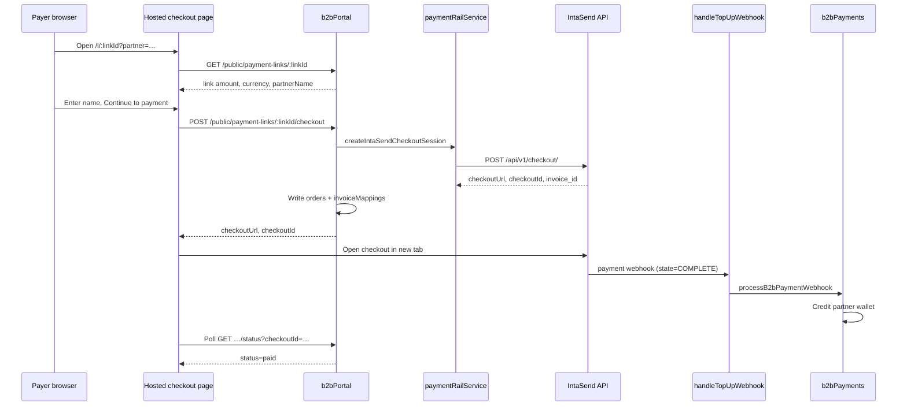

# IntaSend Payments

[IntaSend](https://intasend.com) is TruePay's **B2B guest payment-link rail**. Partners share hosted links; payers complete card or mobile-money checkout on IntaSend; the backend credits the **partner wallet** when payment completes.

Consumer C2B tourist top-ups and B2B partner **Add Money** self-topups have moved to **Paystack** — see [`PAYSTACK_TOURIST.md`](./PAYSTACK_TOURIST.md) and [`B2B_ADD_MONEY.md`](./B2B_ADD_MONEY.md). IntaSend remains active for guest payment links and legacy webhook settlement.

**Safari Card outbound disbursements** (M-Pesa B2B/B2C, PesaLink) use a separate Send Money layer — see [`SAFARI_CARD_PAYOUTS.md`](./SAFARI_CARD_PAYOUTS.md). Collection code in this document is unchanged by that feature.

## Where IntaSend is used today

| Flow | Status | Entry point |
|------|--------|-------------|
| B2B guest payment links | **Active** | `b2bPortal` → `POST /public/payment-links/:linkId/checkout` |
| Legacy consumer top-up webhook | **Active** (legacy orders only) | `handleTopUpWebhook` |
| Admin payment status lookup | **Active** | `getIntaSendPaymentStatus` callable |
| C2B tourist `createPayment` | **Removed** — Paystack only | Rejects `intasendCheckoutId` / IntaSend URLs |
| B2B Add Money (partner self-topup) | **Not IntaSend** — Paystack | `POST /portal/funding/checkout` |

## Architecture

```
Partner creates payment link (portal / platform admin)
  → paymentLinkService.createPaymentLink()
  → Firestore paymentLinks/{linkId}

Payer opens hosted page
  → GET b2bPortal/l/:linkId?partner=…
  → paymentLinkCheckoutPage.js (TruePay-branded HTML)

Payer submits name + "Continue to payment"
  → POST b2bPortal/public/payment-links/:linkId/checkout?partner=…
  → b2bPaymentLinkCheckoutService.startCheckout()
  → paymentRailService.createIntaSendCheckoutSession()
  → IntaSend POST /api/v1/checkout/
  → orders + invoiceMappings written (purpose: b2b_payment_link)

Payer pays on IntaSend hosted checkout
  → IntaSend webhook → handleTopUpWebhook
  → paymentsLib.processPaymentWebhook()
  → b2bPayments.lookupB2bInvoiceMapping()  ← B2B path taken first
  → b2bPayments.processB2bPaymentWebhook()
  → partner wallet credited + b2b_payment transaction

(Optional) Webhook delayed or invoice_id mismatch
  → GET /public/payment-links/:linkId/status?checkoutId=…
  → b2bCheckoutReconcileService.tryReconcileCheckoutSession()
  → paymentRailService.fetchIntaSendPaymentStatus() (poll IntaSend API)
  → same settlement path as webhook
```

## Sequence diagram — B2B payment link



## B2B payment link flow (detail)

### 1. Create link (partner / platform admin)

Authenticated partner org admin or platform admin creates a reusable link:

- **Partner portal:** `POST /portal/payment-links`
- **Platform admin:** `POST /platform/partners/:partnerId/payment-links`

Required fields: `amount`, `currency`, `bookingReference`. Optional: `description`, `expiryHours`.

Links are stored in Firestore `paymentLinks/{linkId}` with `status: "active"`. Each payer session is separate; links stay active after payment (`paymentCount` increments).

Supported link currencies include `USD`, `KES`, and others validated by `paymentLinkService`. IntaSend checkout supports: **KES, USD, GBP, EUR, NGN, GHS** (`INTASEND_CHECKOUT_CURRENCIES` in `paymentRailService.js`).

### 2. Hosted payer page

Public HTML checkout (no auth):

```
GET https://us-central1-truepay-72060.cloudfunctions.net/b2bPortal/l/{linkId}?partner={partnerId}
```

Implemented in `functions/utils/paymentLinkCheckoutPage.js`. The page:

1. Loads link details via `GET /public/payment-links/:linkId?partner=…`
2. Collects payer full name (minimum 2 characters)
3. Calls `POST /public/payment-links/:linkId/checkout?partner=…` with `{ payerName }`
4. Opens IntaSend `checkoutUrl` in a named browser tab
5. Polls `GET /public/payment-links/:linkId/status?partner=…&checkoutId=…` until `status === "paid"`

Post-payment redirect (IntaSend `redirect_url`, path-only — no query string):

```
GET …/b2bPortal/l/{linkId}/success
```

### 3. Start checkout (server-side IntaSend session)

`b2bPaymentLinkCheckoutService.startCheckout()`:

1. Validates link is `active` (or `paid`, which is re-opened for reuse)
2. Parses payer identity (`payerName` required)
3. Builds `api_ref` from `bookingReference` or link ID (sanitized for IntaSend charset limits)
4. Calls `paymentRailService.createSession({ rail: "intasend", … })`
5. Creates Firestore documents:
   - **`orders/{orderId}`** — `orderType: "b2b_payment_link"`, `status: "pending"`
   - **`invoiceMappings/{checkoutId}`** — primary mapping for webhook lookup
   - **Alias docs** — additional IntaSend IDs (`invoice_id`, URL segment, etc.) with `aliasOf: checkoutId`

Default rail is `intasend` unless `B2B_DEFAULT_PAYMENT_RAIL` is set. Passing `rail: "manual"` skips IntaSend and returns a manual-settlement message.

### 4. IntaSend checkout API call

`paymentRailService.createIntaSendCheckoutSession()` posts to:

```
POST {sandbox|payment}.intasend.com/api/v1/checkout/
```

Payload highlights:

| Field | Value |
|-------|-------|
| `public_key` | `INTASEND_PUBLISHABLE_KEY` |
| `amount` / `currency` | From payment link |
| `api_ref` | Sanitized booking ref (webhook correlation) |
| `layout` | `"tabs"` |
| `channel` | `"WEBSITE"` |
| `mobile_tarrif` / `card_tarrif` | `"CUSTOMER-PAYS"` |
| `styles` | TruePay theme (matches hosted page tokens) |
| `redirect_url` | `…/b2bPortal/l/{linkId}/success` |
| `first_name` / `last_name` / `email` / `phone_number` | From payer form |
| `country` | Payer country or currency default (e.g. KES → KE) |
| `merchant_origin` | Optional hostname from `B2B_INTASEND_MERCHANT_ORIGIN` or `PAYMENT_LINK_BASE_URL` |

Response: `checkoutUrl`, `checkoutId`, optional `invoiceId`.

## Webhook settlement

### Endpoint

```
POST https://us-central1-truepay-72060.cloudfunctions.net/handleTopUpWebhook
```

Configure this URL in the IntaSend dashboard for collection/checkout webhooks.

### Authentication

`webhookApi.handleTopUpWebhook` accepts the request when **either**:

- **HMAC signature** — header `x-intasend-signature` (SHA-256 HMAC of raw body, hex-encoded), verified against `INTASEND_SECRET`
- **Challenge token** — header `x-intasend-challenge`, query `challenge`, or body `challenge` matching `INTASEND_CHALLENGE`

At least one of `INTASEND_SECRET` or `INTASEND_CHALLENGE` must be configured.

### Payload parsing

`paymentsLib.parseWebhookPayload()` supports two IntaSend formats:

1. **Legacy event format** — `event: "payment.completed"` with nested `data.payment_id`, `data.amount`, `data.metadata.user_id`
2. **Flat invoice format** — `invoice_id`, `net_amount` / `value`, `currency`, `account` (phone), `state`, `api_ref`

Non-`COMPLETE` states are acknowledged with `200 OK` and no wallet update.

### Routing: B2B before consumer

`processPaymentWebhook()` checks B2B mappings **first**:

```javascript
const b2bMapping = await b2bPayments.lookupB2bInvoiceMapping(paymentId, { apiRef });
if (b2bMapping) {
  return b2bPayments.processB2bPaymentWebhook(paymentData, payload, b2bMapping);
}
// … consumer wallet path below
```

`lookupB2bInvoiceMapping()` resolves by:

- Direct doc ID in `invoiceMappings`
- `checkoutId` or `invoiceId` query
- `api_ref` query
- Cross-reference via `orders` collection

### B2B settlement (`processB2bPaymentWebhook`)

When a B2B mapping matches:

1. Idempotency key: `processB2bPayment:{paymentId}`
2. `walletService.updatePartnerWalletBalance(partnerId, currency, amount)`
3. `transactionService.createTransactionRecord({ type: "b2b_payment", … })`
4. Updates `paymentLinks/{linkId}` — `paymentCount++`, `lastPaidAt`, `lastPayerName`, etc.
5. Marks `orders/{orderId}` and `invoiceMappings/{checkoutId}` as `completed`
6. Writes audit record to `payments/{paymentId}`

Links remain **reusable** — they are not deactivated after payment.

### Legacy consumer path

If no B2B mapping is found, the webhook falls through to the original consumer top-up logic:

1. **Resolve user** (`resolveWalletId`) — phone number from `account` field (primary), order lookup, or `invoiceMappings.userId`
2. **Credit consumer wallet** via `updateBalanceWithTransaction`
3. **Update order** status to `completed`

This path served the old Flutter flow where the app created IntaSend checkout client-side and called `createPaymentOrder`. New C2B apps use Paystack and `handlePaystackWebhook` instead; `createPayment` rejects IntaSend client fields.

## Reconciliation (webhook backup)

When IntaSend webhooks are delayed or `invoice_id` differs from the checkout UUID:

`b2bCheckoutReconcileService.tryReconcileCheckoutSession(checkoutId)`:

1. Loads pending mapping from `invoiceMappings`
2. Polls IntaSend via `fetchIntaSendPaymentStatus()` — tries collection status and checkout endpoints
3. If remote `state === "COMPLETE"`, registers alias IDs and calls `processB2bPaymentWebhook`

Triggered automatically when:

- Payer polls `GET /public/payment-links/:linkId/status?checkoutId=…`
- Partner lists payment links (`reconcilePendingPaymentLinks` in `b2bPortalHttp.js`)

## Admin: payment status lookup

**Callable:** `getIntaSendPaymentStatus`

```javascript
const fn = httpsCallable(functions, "getIntaSendPaymentStatus");
const result = await fn({ invoiceId: "XMSLWOS" });
```

- **Auth:** Firebase Auth + admin custom claim (`admin: true`)
- **App Check:** enforced
- **Secrets:** `INTASEND_SECRET_KEY`, `INTASEND_PUBLISHABLE_KEY`
- Calls IntaSend `GET /api/v1/payment/collections/{invoiceId}/status/`

Also used internally by `fetchIntaSendPaymentStatus()` for B2B reconciliation (uses `INTASEND_SECRET_KEY` bearer token).

## Firestore collections

| Collection | Purpose |
|------------|---------|
| `paymentLinks` | Reusable B2B links (`partnerId`, `amount`, `currency`, `bookingReference`, `paymentCount`, `lastCheckoutId`) |
| `invoiceMappings` | Webhook lookup — B2B docs have `purpose: "b2b_payment_link"`, `partnerId`, `linkId`, `checkoutId`, `apiRef`; consumer docs have `userId` |
| `orders` | Per-checkout session records (`orderType: "b2b_payment_link"` or legacy `"topup"`) |
| `payments` | Raw webhook payload + settlement audit (`partner_id` for B2B, `user_id` for consumer) |

## Configuration

### Firebase secrets / environment

| Secret / env | Used for |
|--------------|----------|
| `INTASEND_PUBLISHABLE_KEY` | Checkout session creation (public key in POST body) |
| `INTASEND_SECRET_KEY` | Admin status API + reconciliation polling (Bearer auth) |
| `INTASEND_SECRET` | Webhook HMAC signature verification |
| `INTASEND_CHALLENGE` | Webhook challenge token (alternative to signature) |
| `INTASEND_ENV=sandbox` | Force sandbox API host |
| `B2B_DEFAULT_PAYMENT_RAIL` | Default rail for checkout (`intasend` if unset) |
| `B2B_INTASEND_MERCHANT_ORIGIN` | Optional `merchant_origin` hostname |
| `PAYMENT_LINK_BASE_URL` | Fallback for merchant origin hostname |

### Sandbox vs production

Determined by publishable/secret key content (`sandbox`, `test`) or `INTASEND_ENV=sandbox`:

- Sandbox: `https://sandbox.intasend.com`
- Production: `https://payment.intasend.com`

## What is NOT IntaSend anymore

### C2B tourist `createPayment`

The Flutter C2B app must **not** create IntaSend checkout client-side. `createPayment` (Paystack) rejects:

- `intasendCheckoutId`
- `checkoutUrl` containing `intasend.com`

See [`PAYSTACK_TOURIST.md`](./PAYSTACK_TOURIST.md) and [`PAYMENTS_CLIENT_FIXES.md`](./PAYMENTS_CLIENT_FIXES.md).

### B2B Add Money

Partner self-topup uses Paystack KES hosted checkout via `POST /portal/funding/checkout` — not IntaSend. See [`B2B_ADD_MONEY.md`](./B2B_ADD_MONEY.md).

## Deploy

```bash
# Webhook verification
firebase functions:secrets:set INTASEND_SECRET
firebase functions:secrets:set INTASEND_CHALLENGE

# Checkout + admin/reconcile API
firebase functions:secrets:set INTASEND_PUBLISHABLE_KEY
firebase functions:secrets:set INTASEND_SECRET_KEY

firebase deploy --only functions:handleTopUpWebhook,functions:getIntaSendPaymentStatus,functions:b2bPortal
```

## Key source files

| File | Role |
|------|------|
| `functions/services/paymentRailService.js` | IntaSend checkout API, status polling, rail abstraction |
| `functions/services/b2bPaymentLinkCheckoutService.js` | Start checkout, public status, mapping creation |
| `functions/libs/b2bPayments.js` | B2B webhook settlement → partner wallet |
| `functions/services/b2bCheckoutReconcileService.js` | Poll IntaSend when webhook is late |
| `functions/http/webhookApi.js` | `handleTopUpWebhook` HTTP handler |
| `functions/libs/payments.js` | Signature verify, payload parse, B2B/consumer routing |
| `functions/http/b2bPortalHttp.js` | Public checkout routes, hosted page, link CRUD |
| `functions/utils/paymentLinkCheckoutPage.js` | TruePay-branded payer HTML + polling JS |
| `functions/services/paymentLinkService.js` | Payment link CRUD |
| `functions/libs/adminActions.js` | `getIntaSendPaymentStatus` implementation |
| `functions/http/adminHttp.js` | Admin callable export |
| `functions/http/paymentsHttp.js` | Legacy IntaSend rejection in `createPayment` |

## Related docs

- [`B2B_FRONTEND_INSTRUCTIONS.md`](./B2B_FRONTEND_INSTRUCTIONS.md) — B2B portal integration (payment links unchanged)
- [`PAYSTACK_TOURIST.md`](./PAYSTACK_TOURIST.md) — Consumer C2B top-up (replaced IntaSend)
- [`B2B_ADD_MONEY.md`](./B2B_ADD_MONEY.md) — Partner Add Money (Paystack, not IntaSend)
