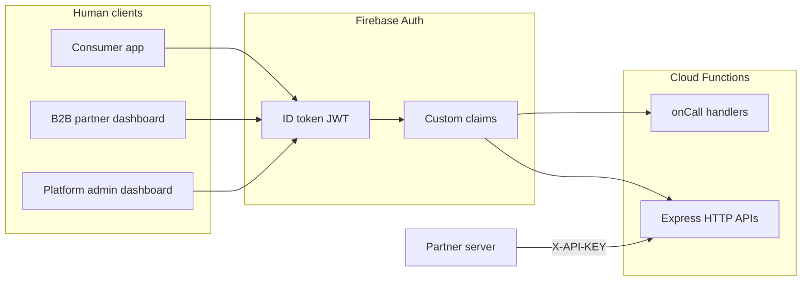

# TruePay authentication & authorization

How users and services are authenticated in this backend (`rates_function`), which roles exist, and where credentials live.

For B2B onboarding flows see [`onboarding.md`](./onboarding.md). For API schemas see [`B2B_docs.md`](./B2B_docs.md).

---

## Overview

TruePay uses **Firebase Authentication** as the single identity provider for human users. There is no custom session store or JWT issuer in this repo — clients obtain Firebase **ID tokens** and send them to Cloud Functions.

Authorization (what a caller may do) is enforced separately via:

1. **Firebase custom claims** on the ID token (`userType`, `role`, `partnerId`; legacy `admin`, `partnerRole`)
2. **Firestore `users/{uid}.permissions`** (B2B dashboard UI; not used for API gates today)
3. **Partner API keys** in `partners/{id}.apiKey` (machine-to-machine)
4. **Webhook HMAC / provider signatures** (IntaSend, TransFi, Circle)
5. **Firestore security rules** (direct client reads/writes to Firestore)

Central module: **`functions/utils/accessControl.js`**



**Core verification:** `functions/libs/auth.js`

| Helper | Header / input | Result |
|--------|----------------|--------|
| `verifyFirebaseAuth(req)` | `Authorization: Bearer <idToken>` | `userId`, `decodedToken` |
| `verifyPartnerRequest(req)` | `X-API-KEY: <hex>` | `partnerId`, partner doc |

---

## User types and roles

### 1. Consumer (C2B) app user

| Aspect | Detail |
|--------|--------|
| **Identity** | Firebase Auth (email/password or other providers) |
| **Provisioning** | `POST /api/register` or `userBootstrap` callable → `users/{uid}` with `institution: "Customer App"`, `channel: "C2B"` |
| **Token claims** | `{ userType: "customer" }` (set on `POST /api/register`) |
| **API access** | Own data via callables (`createPayment`, `createSwapOrder`, …) and REST (`transactionsApi`, `cryptoApi`) scoped to `auth.uid` |
| **Firestore** | Read/write own docs; read public `config`, `p2pRates` |

### 2. B2B partner dashboard user

| Aspect | Detail |
|--------|--------|
| **Identity** | Firebase Auth |
| **Provisioning** | `POST /b2bPortal/portal/ensure-dashboard-profile` → `users/{uid}` with `institution: "PartnerDashboard"`, `channel: "B2B"`, `status: "Active"`, default `permissions` |
| **Org linkage** | After `POST /portal/onboarding/register-partner` (or platform admin assigns owner): claims `userType: "partner"`, `partnerId`, `role` |
| **Partner roles** (`role` claim; legacy `partnerRole`) | See table below |
| **API access** | `/b2bPortal/portal/*` — see [B2B portal routes](#b2b-portal-b2bportal) |

**B2B partner roles** (`functions/services/b2bMemberService.js` + `accessControl.js`):

| Role | Claim `role` | Legacy `partnerRole` | Typical access |
|------|--------------|----------------------|----------------|
| Owner | `owner` | `org_admin` | Full partner portal: members, payment links, org settings |
| Finance | `finance` | `finance` | Finance-oriented portal features |
| Support | `support` | `support` | Support-oriented portal features |
| Operations | `operations` | `operations` | Operations-oriented |
| Viewer | `viewer` | `viewer` / `member` | Read-heavy partner portal |

Only **owner** may invite/remove members and mutate payment links (`requirePartnerOrgAdmin` middleware — checks `owner`, accepts legacy `org_admin`).

**Default Firestore permissions** (UI gating, not API claims):

```text
dashboard.view, notifications.view, settings.view
```

Set on new B2B dashboard users in `ensureUserDashboardProfile`; never overwritten if already present.

### 3. Platform admin

| Aspect | Detail |
|--------|--------|
| **Identity** | Firebase Auth |
| **Authorization** | `{ userType: "admin", role: "<admin_role>" }` and/or legacy **`admin: true`** |
| **Admin roles** | `super_admin`, `operations_admin`, `support_admin`, `finance_admin` |
| **Built-in super admin** | Email `MASTER_ADMIN_EMAIL` (default `calvinrumba8@gmail.com`) — **no password in code**; bootstrap via `npm run auth:bootstrap-super-admin` |
| **Registry** | `platformAdmins/{uid}` in Firestore |
| **API access** | `/b2bPortal/platform/*`, admin callables, `api` admin routes, system notification inbox (super_admin) |
| **Granting admin** | Super admin calls `setAdminClaim` callable with optional `role` |

**Platform admin check** (`isPlatformAdmin` in `accessControl.js`):

1. `userType === "admin"` with valid `role`, **or**
2. Legacy `admin: true`, **or**
3. Built-in super-admin email on Auth user record

### 4. Partner integration (server)

| Aspect | Detail |
|--------|--------|
| **Identity** | Not a Firebase user — **`X-API-KEY`** per `partners/{id}` |
| **Live API** | `partner` function — key must belong to partner with `status: active` (not `pending_review`, etc.) |
| **Sandbox API** | `partnerSandbox` function — shared [sandbox key](#hardcoded--environment-credentials) |

### 5. Webhooks & jobs (no user)

| Source | Auth |
|--------|------|
| IntaSend | HMAC / challenge (`INTASEND_SECRET`, `INTASEND_CHALLENGE`) |
| TransFi | Signature header + `TRANSFI_WEBHOOK_SECRET` |
| Circle | Signature verification in `circleWebhookService` |
| Scheduled jobs | No HTTP auth — runs as Cloud Functions service account |

---

## Custom claims reference

Stored on Firebase Auth users; appear on ID token after sign-in / refresh.

| Claim | Set by | Purpose |
|-------|--------|---------|
| `userType` | `accessControl` setters | `customer` \| `partner` \| `admin` |
| `role` | Same | Partner role or platform admin role |
| `partnerId` | `setPartnerAccessClaims` | B2B org scope |
| `partnerRole` | Same (legacy mirror) | Backward compatible B2B role (`org_admin` for owner) |
| `admin: true` | `setAdminAccessClaims` (super_admin only) | Legacy platform admin / Firestore `isAdmin()` |
| `platform.super` | *(optional)* | Notifications super inbox (legacy) |

**Merge helper:** `functions/utils/customClaimsMerge.js` — patches claims without dropping unrelated keys.

**Important:** After claims change, users must **refresh the ID token** (sign out/in) before `/portal/me` or partner routes succeed.

---

## Authentication by Cloud Function

### Callable functions (`onCall`)

Firebase SDK attaches `request.auth` automatically.

| Pattern | Examples |
|---------|----------|
| Any signed-in user | `createPayment`, `userBootstrap`, `createDirectTopup` |
| Admin claim required | `updateUserBalance`, `getUserData`, `setAdminClaim` |
| Mixed / special | `getBinanceRates` (check each handler) |

Many callables set **`enforceAppCheck: true`** — client must also send a valid App Check token.

### REST HTTP APIs

| Function | Auth model | Notes |
|----------|------------|-------|
| **`b2bPortal`** | Bearer JWT + route middleware | See [B2B portal](#b2b-portal-b2bportal) |
| **`partner`** | `X-API-KEY` | Live partner integration |
| **`partnerSandbox`** | Static sandbox `X-API-KEY` | Mock data only |
| **`api`** (customer wallets) | Mixed: public rates; Bearer JWT for `/accounts`; `requireAdmin` for wallet CRUD | Admin = `admin` claim or master email |
| **`transactionsApi`** | Bearer JWT; queries scoped to `auth.uid` | |
| **`cryptoApi`** | Bearer JWT per route | |
| **`notificationsApi`** | Bearer JWT + inbox scoping | See `notificationAccess.js` |
| **`migrateUsersHttp`** | **None on HTTP POST** | ⚠️ See [security notes](#security-notes--gaps) |
| **Webhooks** | Provider signatures | Not Firebase user auth |

Public **no-auth** examples:

- `GET /api/customer-rates`, `/api/rates`, `/api/countries`
- `GET /b2bPortal/public/payment-links/*` (payer checkout)
- `GET /partnerSandbox/checkout/*` (sandbox checkout pages)

Authenticated **C2B customer** (Bearer Firebase ID token + App Check on `api`):

- `GET /api/accounts` (alias `GET /api/wallets`) — fiat + crypto account list for the caller. Replaces direct RTDB `wallet/{uid}/fiat|crypto` reads in the Flutter app. See [`docs/rates.md`](./rates.md) § Accounts API.

### B2B portal (`b2bPortal`)

Middleware chain in `functions/http/b2bPortalHttp.js`:

| Middleware | Requirement |
|------------|-------------|
| `loadFirebaseUser` | Valid Bearer token |
| `requirePlatformAdmin` | `isPlatformAdmin` (new claims, legacy `admin`, or built-in email) |
| `attachPartnerContext` | `userType: partner` or legacy `partnerId` + role |
| `requirePartnerOrgAdmin` | Partner **owner** (legacy `org_admin` accepted) |
| `attachPartnerContextOrPlatformAdmin` | Partner **or** platform admin |

| Route prefix | Who |
|--------------|-----|
| `/platform/*` | Platform super-admin |
| `/portal/ensure-dashboard-profile`, `/portal/onboarding`, sandbox routes | Any authenticated Firebase user |
| `/portal/me`, `/portal/members`, payment links (mutations) | Partner claims; org admin for writes |
| `/public/*`, `/l/*` | Unauthenticated payer flows |

**Email gate:** `POST /portal/onboarding/register-partner` returns **403 `EMAIL_NOT_VERIFIED`** if `email_verified !== true` on token.

### Notifications (`notificationsApi`)

After Bearer auth, `notificationAccess.js` enforces:

- Default inbox = caller’s **`auth.uid`** (not `"system"`)
- `userId=system` only for platform super (`platform.super`, `admin`, or master email)
- Hide `direct_*_admin_alert` types from non–super-admin tokens
- Mark-read scoped the same way

### Firestore client access

When apps read Firestore directly (e.g. B2B dashboard polling `users/{uid}`), **`firestore.rules`** apply:

- **`isAdmin()`** → `request.auth.token.admin == true` (not master email alone)
- Users read all `users` docs when authenticated (broad read for admin UIs)
- **`notifications`**: clients can read `userId == uid`, **`userId == "system"`**, or admin — API scoping is stricter than rules for B2B partners
- Balance fields on `users` cannot be updated by clients
- **`onboarding/{uid}`**, **`partners/*`**: default deny — only Admin SDK (Cloud Functions) writes

Cloud Functions use the **Admin SDK** and bypass rules.

---

## Hardcoded & environment credentials

### ⚠️ Hardcoded defaults in source (review for production)

| Location | Value | Risk / note |
|----------|-------|-------------|
| `functions/utils/adminClaims.js` | `MASTER_ADMIN_EMAIL` defaults to **`calvinrumba8@gmail.com`** | Platform super-admin bypass if env not set. Override with env **`MASTER_ADMIN_EMAIL`**. |
| `functions/config.js` | **`KalvoB2B-Sandbox-public-test-key-2026`** | Default B2B sandbox `X-API-KEY` if `B2B_SANDBOX_PUBLIC_API_KEY` unset. Intended for dev; override in prod. |
| `functions/admin.js` | `projectId: "truepay-72060"`, RTDB URL | Firebase project binding — not a secret, but environment-specific. |

### Secrets via Firebase Functions / env (not in repo)

Configured with `firebase functions:secrets:set` or deployment env — **correct pattern**:

| Secret / env | Used for |
|--------------|----------|
| `INTASEND_SECRET`, `INTASEND_CHALLENGE`, `INTASEND_SECRET_KEY`, `INTASEND_PUBLISHABLE_KEY` | Payments / webhooks |
| `TRANSFI_WEBHOOK_SECRET` | TransFi webhooks |
| `CIRCLE_API_KEY`, `CIRCLE_ENTITY_SECRET` | Circle wallet / webhooks |
| `WEB_API_KEY` | Password reset / change / set-pin (Identity Toolkit). Same value as client web `apiKey`. (Do not name it `FIREBASE_*` — Secret Manager reserved prefix.) |
| `SMTP_USER`, `SMTP_PASS` | Zoho SMTP for branded verification (`sendEmailVerification`, `POST /portal/send-verification-email`) |
| `B2B_SANDBOX_PUBLIC_API_KEY` | Override sandbox API key |
| `MASTER_ADMIN_EMAIL` | Override super-admin email |

**Partner live API keys** are generated per org (`partnerService.generateApiKey()`), stored in Firestore `partners/{id}.apiKey`, returned once at creation — not hardcoded.

### Not found in repo (good)

- No committed `.env` files with live secrets
- No embedded IntaSend/Circle production keys in JS source
- Passwords only accepted in request bodies for user creation (member invite, C2B register) — never stored in code

---

## Security notes & gaps

1. **`migrateUsersHttp` POST `/migrateUsers`** — no authentication on the HTTP endpoint. Callable version has App Check but HTTP does not verify caller. Restrict or protect before production exposure.

2. **Master email allowlist** — `isSuperAdminUid` grants platform admin even without `admin: true` claim. Ensure `MASTER_ADMIN_EMAIL` is set explicitly in production.

3. **Firestore notification rules** — any authenticated user can still read `userId == "system"` notifications via Firestore SDK; **`notificationsApi`** now restricts this for B2B partners, but direct Firestore reads may still leak admin alerts until rules are tightened.

4. **Broad `users` read** — any authenticated user can read all `users` documents per Firestore rules (dashboard requirement); sensitive fields should not live on `users` without additional rules.

5. **Token staleness** — `customerWalletsHttp` `requireAdmin` re-checks live Auth record if token lacks `admin` claim; `b2bPortal` relies on token claims for partner routes — users must refresh after claim changes.

6. **App Check** — enforced on many callables and some HTTP functions; not uniform across every Express app.

---

## Quick reference: “How do I authenticate as…?”

| I am… | Send… | To… |
|-------|-------|-----|
| Consumer app user | `Authorization: Bearer <idToken>` | `transactionsApi`, `cryptoApi`, callables |
| B2B partner (dashboard) | Bearer token (with `partnerId` / `partnerRole` after onboarding) | `b2bPortal/portal/*` |
| Platform admin | Bearer token + `admin: true` or master email | `b2bPortal/platform/*`, admin callables, `api` admin routes |
| Partner backend | `X-API-KEY: <partner apiKey>` | `partner/*` |
| Sandbox integration test | `X-API-KEY: <sandbox key>` | `partnerSandbox/*` |

---

## Key source files

| File | Role |
|------|------|
| `functions/libs/auth.js` | ID token + partner API key verification |
| `functions/utils/accessControl.js` | Claims, roles, `isPlatformAdmin`, partner/admin setters |
| `functions/utils/adminClaims.js` | Thin re-export + legacy callable helpers |
| `functions/scripts/bootstrap-super-admin.js` | One-time super-admin bootstrap (email only) |
| `functions/utils/customClaimsMerge.js` | Partner/admin claim merge |
| `functions/utils/notificationAccess.js` | Notification inbox authorization |
| `functions/http/b2bPortalHttp.js` | B2B portal middleware |
| `functions/services/b2bMemberService.js` | Partner roles, member invites, dashboard profile |
| `firestore.rules` | Client-side Firestore authorization |
| `functions/config.js` | Secret names, sandbox defaults, env helpers |

---

## Related docs

- [`FRONTEND_AUTH_HANDOFF.md`](./FRONTEND_AUTH_HANDOFF.md) — C2B + B2B web team integration notes
- [`onboarding.md`](./onboarding.md) — B2B signup, claims timing, provisioning
- [`README_HIGH_LEVEL.md`](./README_HIGH_LEVEL.md) — Architecture summary
- [`B2B_docs.md`](./B2B_docs.md) — B2B API reference
