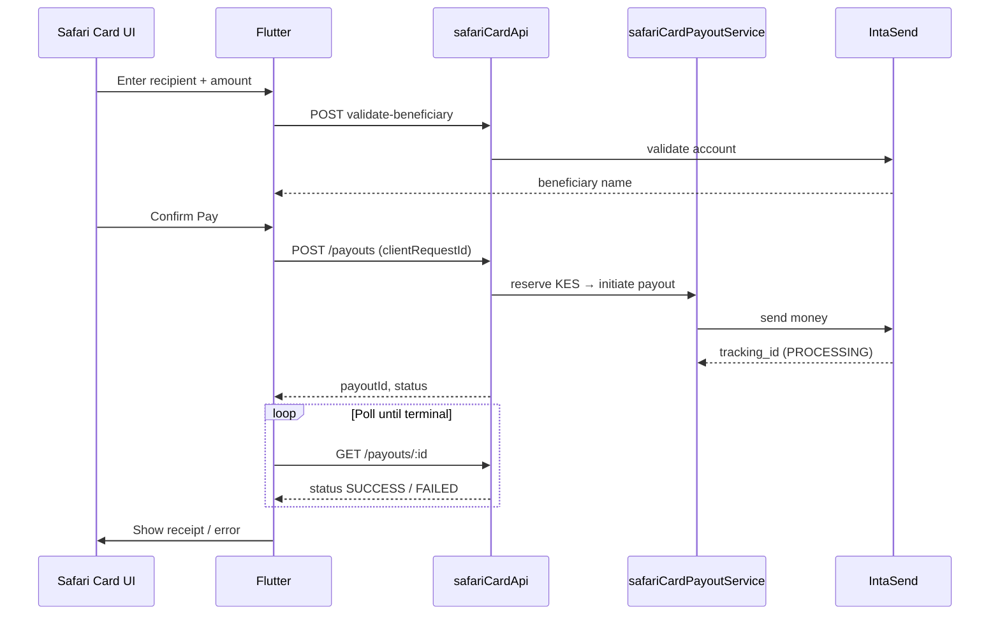

# Safari Card Pay — Flutter Integration Guide

Guide for the **Safari Card** mobile app team to integrate outbound payments (M-Pesa B2C/B2B, bank/PesaLink). The backend owns all IntaSend credentials and disbursement logic. The app only needs **Firebase Auth** and the **`safariCardApi`** REST endpoints.

Backend reference: [`SAFARI_CARD_PAYOUTS.md`](./SAFARI_CARD_PAYOUTS.md).

---

## What you are building

| Screen / feature | Backend endpoint |
|------------------|------------------|
| Send to M-Pesa phone | `POST /safari-card/payouts` (`MPESA_B2C`) |
| Pay Till Number | `POST /safari-card/payouts` (`MPESA_B2B` + `TillNumber`) |
| Pay PayBill | `POST /safari-card/payouts` (`MPESA_B2B` + `PayBill`) |
| Send to bank | `POST /safari-card/payouts` (`BANK`) |
| Verify recipient name | `POST /safari-card/payouts/validate-beneficiary` |
| Pay TruePay merchant (profile QR / merchant ID) | `POST /safari-card/payouts` (`TRUEPAY_MERCHANT`) |
| Resolve scanned QR | `POST /safari-card/merchants/resolve` |
| Bank picker | `GET /safari-card/banks` |
| Payment status | `GET /safari-card/payouts/:payoutId` |
| Payment history | `GET /safari-card/payouts` |

**Currency:** KES only for Safari Card payouts.

**Do not** integrate IntaSend SDK, secret keys, or disbursement APIs in Flutter. All payouts go through TruePay backend.

---

## Base URL

| Environment | Base URL |
|-------------|----------|
| **Production** | `https://us-central1-truepay-72060.cloudfunctions.net/safariCardApi` |
| **Emulator** | `http://localhost:5001/truepay-72060/us-central1/safariCardApi` |
| **Android emulator → host** | `http://10.0.2.2:5001/truepay-72060/us-central1/safariCardApi` |

All paths below are relative to this base (e.g. `POST /safari-card/payouts` → `{base}/safari-card/payouts`).

---

## Authentication

Every request requires a **Firebase ID token** from project **`truepay-72060`** (same project as this Cloud Function and the KES wallet in RTDB):

```http
Authorization: Bearer <firebase-id-token>
Content-Type: application/json
```

If the Flutter app is initialized with a different Firebase project, token verification fails with `401 UNAUTHORIZED` (often an **audience** mismatch in the response body).

### Flutter setup

```yaml
dependencies:
  firebase_auth: ^5.x
  firebase_database: ^11.x   # KES balance listener (recommended)
  http: ^1.x                 # or dio
  uuid: ^4.x                 # clientRequestId generation
```

Get the ID token for HTTP headers:

```dart
import 'package:firebase_auth/firebase_auth.dart';

Future<Map<String, String>> payApiHeaders() async {
  final user = FirebaseAuth.instance.currentUser;
  if (user == null) throw Exception('Not signed in');

  final idToken = await user.getIdToken();
  if (idToken == null || idToken.isEmpty) {
    throw Exception('Missing ID token');
  }

  return {
    'Authorization': 'Bearer $idToken',
    'Content-Type': 'application/json',
  };
}
```

### Common 401 causes

| Response `error` (in response body) | Fix |
|-------------------------------------|-----|
| `Missing or invalid Authorization header` | Send `Authorization: Bearer <idToken>` on every request |
| `Firebase ID token has expired...` | Call `await user.getIdToken(true)` immediately before the request |
| `incorrect "aud" (audience) claim...` | Flutter must use Firebase project **`truepay-72060`** (`google-services.json` / `GoogleService-Info.plist`) |
| `invalid signature` | Do not point a release build at the **Auth emulator**; use production Auth |
| `Decoding Firebase ID token failed...` | You are not sending a Firebase **ID token** (e.g. App Check token or refresh token in `Authorization`) |

Log the full response on failure (after redeploy, 401 bodies include `hint` and `token` diagnostics):

```dart
debugPrint('pay API ${res.statusCode}: ${res.body}');
```

Example 401 when the app uses the wrong Firebase project:

```json
{
  "success": false,
  "error": "Firebase ID token has incorrect \"aud\" (audience) claim...",
  "code": "UNAUTHORIZED",
  "hint": "Firebase project mismatch. App must use truepay-72060 (check google-services.json project_id).",
  "token": {
    "aud": "some-other-project",
    "iss": "https://securetoken.google.com/some-other-project",
    "exp": 1755729000,
    "expired": false,
    "expectedProject": "truepay-72060",
    "projectMatch": false,
    "looksLikeFirebaseIdToken": false
  }
}
```

---

## Architecture (app view)



Payout settlement is **asynchronous**. A `201` response means the payout was **initiated**, not necessarily completed. Poll until `SUCCESS`, `FAILED`, or `CANCELLED`.

---

## KES balance (before Pay)

Safari Card debits the user's **KES fiat wallet**. Show available balance from Realtime Database:

**Path:** `wallet/{userId}/fiat/KES`

```dart
import 'package:firebase_auth/firebase_auth.dart';
import 'package:firebase_database/firebase_database.dart';

Stream<double> kesBalanceStream() {
  final uid = FirebaseAuth.instance.currentUser?.uid;
  if (uid == null) return Stream.value(0);

  final ref = FirebaseDatabase.instance.ref('wallet/$uid/fiat/KES');
  return ref.onValue.map((event) {
    final v = event.snapshot.value;
    if (v is num) return v.toDouble();
    return double.tryParse('$v') ?? 0;
  });
}
```

The backend reserves `amount + fee` before calling IntaSend. If balance is too low, the API returns `402` with code `INSUFFICIENT_BALANCE`. Fees are configured server-side — display `totalDebit` from the create response when available.

---

## Recommended UX flow

1. User selects payout type (M-Pesa / Till / PayBill / Bank).
2. User enters recipient details and amount.
3. **Optional but recommended:** call `validate-beneficiary` and show the returned name (“Pay Jane Doe?”).
4. User taps **Pay** once — generate `clientRequestId` (UUID) and disable the button.
5. `POST /safari-card/payouts` with that `clientRequestId`.
6. Navigate to a **processing** screen; poll `GET /safari-card/payouts/:payoutId` every 2–3 seconds.
7. On `SUCCESS` → receipt screen. On `FAILED` / `CANCELLED` → show `failureReason`.
8. On network error after submit → retry **GET** by `payoutId` or **POST** with the **same** `clientRequestId` (never mint a new id for the same tap).

---

## Payout types & request bodies

### M-Pesa B2C (send to phone)

```json
{
  "type": "MPESA_B2C",
  "amount": 5000,
  "currency": "KES",
  "clientRequestId": "a1b2c3d4-e5f6-7890-abcd-ef1234567890",
  "recipient": {
    "phoneNumber": "254712345678",
    "name": "Jane Doe"
  },
  "narrative": "Safari Card transfer"
}
```

Phone numbers: prefer `2547XXXXXXXX`. The backend also accepts `07XXXXXXXX` and normalizes when appropriate.

### M-Pesa B2B — Till Number

```json
{
  "type": "MPESA_B2B",
  "accountType": "TillNumber",
  "amount": 1500,
  "currency": "KES",
  "clientRequestId": "till-pay-uuid-here-min-8-chars",
  "recipient": {
    "account": "512345",
    "name": "Merchant Name"
  },
  "narrative": "Safari Card payment"
}
```

**Do not** send `accountReference` for Till payments.

### M-Pesa B2B — PayBill

```json
{
  "type": "MPESA_B2B",
  "accountType": "PayBill",
  "amount": 1500,
  "currency": "KES",
  "clientRequestId": "paybill-uuid-here-min-8-chars",
  "recipient": {
    "account": "123456",
    "accountReference": "INV-10291",
    "name": "Utility Co"
  },
  "narrative": "Safari Card payment"
}
```

`accountReference` is **required** for PayBill (1–20 characters).

### Bank / PesaLink

```json
{
  "type": "BANK",
  "amount": 10000,
  "currency": "KES",
  "clientRequestId": "bank-uuid-here-min-8-chars",
  "recipient": {
    "bankCode": "68",
    "accountNumber": "0123456789",
    "accountName": "Jane Doe"
  },
  "narrative": "Safari Card bank transfer"
}
```

Bank amount limits: **KES 100 – 999,999**. Load bank list from `GET /safari-card/banks` — do not hardcode.

---

## API reference

### POST `/safari-card/payouts/validate-beneficiary`

Validates recipient with IntaSend before the user confirms.

**Request:** same `type` / `recipient` shape as create (amount not required).

**Response `200`:**

```json
{
  "success": true,
  "data": {
    "valid": true,
    "account": "254712345678",
    "accountType": null,
    "bankCode": null,
    "beneficiaryName": "JANE DOE",
    "provider": "intasend",
    "providerStatus": "valid"
  }
}
```

Only show “verified recipient” UI when `valid: true` and `beneficiaryName` is non-empty.

**TruePay merchant profile** (`type: TRUEPAY_MERCHANT`): pass `merchantId` or `qrPayload` from the scanned profile QR (`…/p/{merchantId}`). `beneficiaryName` is the partner display name. If resolve/validate reports a **product** link (`…/l/{linkId}`), do not use this payout type — open the hosted product checkout.

```
POST /safari-card/merchants/resolve
{ "payload": "<camera result>" }
```

---

### POST `/safari-card/payouts`

Creates and initiates a payout.

**Response `201`:**

```json
{
  "success": true,
  "data": {
    "status": "PROCESSING",
    "provider": "intasend",
    "amount": 5000,
    "fee": 0,
    "totalDebit": 5000,
    "currency": "KES",
    "merchantName": "Calvin Rumba Mbui",
    "mpesaReference": "UHKUE3131L",
    "recipient": {
      "account_type": "TillNumber",
      "account": "4963167",
      "account_reference": null
    },
    "failureReason": null,
    "createdAt": "2026-08-20T18:00:00.000Z",
    "updatedAt": "2026-08-20T18:00:01.000Z",
    "completedAt": null,
    "failedAt": null
  }
}
```

Store `clientRequestId` for idempotent status checks. Poll with `GET /safari-card/payouts/:payoutId` using the document id returned only on first create if your client caches it, or re-POST with the same `clientRequestId`, or use `GET /safari-card/payouts?limit=20`.

`payoutId` and `providerTrackingId` are **not** included in API responses (internal only).

---

### GET `/safari-card/payouts/:payoutId`

Returns payout status for the authenticated user. Triggers server-side reconciliation if still in-flight.

Poll until status is terminal: `SUCCESS`, `FAILED`, or `CANCELLED`.

**Preferred (no internal payout id):**

```
GET /safari-card/payouts/by-client-request/{clientRequestId}
```

**Legacy (if your client cached the Firestore document id):**

```
GET /safari-card/payouts/{payoutId}
```

---

### GET `/safari-card/payouts?limit=20`

Returns recent payouts for the signed-in user (newest first). `limit` max 50.

---

### GET `/safari-card/banks`

Returns Kenyan bank codes for the bank picker.

```json
{
  "success": true,
  "data": [
    { "bank_name": "KCB", "bank_code": "1" },
    { "bank_name": "Equity Bank", "bank_code": "68" }
  ]
}
```

---

## Payout status (UI mapping)

| Status | Show in UI | Action |
|--------|------------|--------|
| `PENDING` | Processing… | Keep polling |
| `INITIATED` | Processing… | Keep polling |
| `PROCESSING` | Processing… | Keep polling |
| `RETRY` | Processing… | Keep polling |
| `UNKNOWN` | Processing… | Keep polling |
| `SUCCESS` | Payment successful | Stop polling, show receipt |
| `FAILED` | Payment failed | Stop polling, show `failureReason` |
| `CANCELLED` | Payment cancelled | Stop polling |

Typical M-Pesa payout completes in a few seconds; bank transfers may take longer. Poll for up to 2–3 minutes, then show “still processing” with option to check history later.

---

## Error codes

All errors: `{ "success": false, "error": "...", "code": "..." }`

| HTTP | `code` | When | Flutter action |
|------|--------|------|----------------|
| 401 | `UNAUTHORIZED` | Missing/invalid **Firebase** token | Re-auth, `getIdToken(true)` — **do not retry on other codes** |
| 502 | `PROVIDER_AUTH_ERROR` | IntaSend rejected server API keys | Show “payments temporarily unavailable”; **not** a sign-in issue |
| 402 | `INSUFFICIENT_BALANCE` | Not enough KES | Show balance, reduce amount |
| 400 | `INVALID_PHONE_NUMBER` | Bad M-Pesa number | Highlight phone field |
| 400 | `INVALID_PAYBILL_REFERENCE` | Missing/invalid reference | Highlight reference field |
| 400 | `INVALID_BANK_ACCOUNT` | Bad bank details | Highlight bank form |
| 400 | `INVALID_AMOUNT` | Zero, negative, or out of range | Highlight amount |
| 400 | `VALIDATION_FAILED` | e.g. short `clientRequestId` | Fix client validation |
| 400 | `UNSUPPORTED_PAYOUT_TYPE` | Unknown `type` | Fix request |
| 404 | `NOT_FOUND` | Unknown `payoutId` | Navigate back |
| 502 | `PROVIDER_ERROR` / `PAYOUT_FAILED` | IntaSend payout failure | Show retry; same `clientRequestId` if unsure whether payout was created |

**Important:** Only retry on HTTP **401** when `code == "UNAUTHORIZED"`. Provider errors use **502** and codes like `PROVIDER_AUTH_ERROR` or `PROVIDER_ERROR`.

---

## Idempotency (critical)

- Generate **one** `clientRequestId` per user tap on Pay (use `Uuid().v4()`).
- Minimum length: **8 characters**.
- On timeout or ambiguous network error **after** submit: retry with the **same** `clientRequestId` — the backend returns the existing payout instead of creating a duplicate.
- Never generate a new `clientRequestId` for the same user action.

```dart
import 'package:uuid/uuid.dart';

final clientRequestId = const Uuid().v4();

// Use the same clientRequestId for retries of THIS pay action only
await payApi.createPayout(body: {...}, clientRequestId: clientRequestId);
```

---

## Flutter service example

```dart
import 'dart:convert';
import 'package:http/http.dart' as http;

class SafariCardPayApi {
  SafariCardPayApi({
    required this.baseUrl,
    required this.getHeaders,
    http.Client? httpClient,
  }) : _http = httpClient ?? http.Client();

  final String baseUrl;
  final Future<Map<String, String>> Function() getHeaders;
  final http.Client _http;

  Future<Map<String, dynamic>> validateBeneficiary(Map<String, dynamic> body) async {
    final res = await _http.post(
      Uri.parse('$baseUrl/safari-card/payouts/validate-beneficiary'),
      headers: await getHeaders(),
      body: jsonEncode(body),
    );
    return _parse(res);
  }

  Future<Map<String, dynamic>> createPayout(Map<String, dynamic> body) async {
    final res = await _http.post(
      Uri.parse('$baseUrl/safari-card/payouts'),
      headers: await getHeaders(),
      body: jsonEncode(body),
    );
    return _parse(res, expectedStatus: 201);
  }

  Future<Map<String, dynamic>> getPayout(String payoutId) async {
    final res = await _http.get(
      Uri.parse('$baseUrl/safari-card/payouts/$payoutId'),
      headers: await getHeaders(),
    );
    return _parse(res);
  }

  Future<List<Map<String, dynamic>>> listPayouts({int limit = 20}) async {
    final res = await _http.get(
      Uri.parse('$baseUrl/safari-card/payouts?limit=$limit'),
      headers: await getHeaders(),
    );
    final parsed = _parse(res);
    final data = parsed['data'];
    if (data is List) {
      return data.cast<Map<String, dynamic>>();
    }
    return [];
  }

  Future<List<Map<String, dynamic>>> listBanks() async {
    final res = await _http.get(
      Uri.parse('$baseUrl/safari-card/banks'),
      headers: await getHeaders(),
    );
    final parsed = _parse(res);
    final data = parsed['data'];
    if (data is List) {
      return data.cast<Map<String, dynamic>>();
    }
    return [];
  }

  Map<String, dynamic> _parse(http.Response res, {int expectedStatus = 200}) {
    final body = jsonDecode(res.body) as Map<String, dynamic>;
    if (res.statusCode != expectedStatus || body['success'] != true) {
      throw PayApiException(
        statusCode: res.statusCode,
        message: body['error']?.toString(),
        code: body['code']?.toString(),
      );
    }
    return body;
  }
}

class PayApiException implements Exception {
  PayApiException({required this.statusCode, this.message, this.code});
  final int statusCode;
  final String? message;
  final String? code;

  @override
  String toString() => 'PayApiException($statusCode, $code: $message)';
}
```

### Polling helper

```dart
Future<Map<String, dynamic>> pollPayoutUntilTerminal(
  SafariCardPayApi api,
  String payoutId, {
  Duration interval = const Duration(seconds: 2),
  Duration timeout = const Duration(minutes: 3),
}) async {
  final deadline = DateTime.now().add(timeout);
  const terminal = {'SUCCESS', 'FAILED', 'CANCELLED'};

  while DateTime.now().isBefore(deadline)) {
    final res = await api.getPayout(payoutId);
    final data = res['data'] as Map<String, dynamic>;
    final status = data['status'] as String?;
    if (status != null && terminal.contains(status)) {
      return data;
    }
    await Future.delayed(interval);
  }
  throw TimeoutException('Payout still processing');
}
```

---

## Screen checklist

### Send money (M-Pesa)

- [ ] Phone input with KE formatting hint (`07…` or `2547…`)
- [ ] Amount input (positive, KES)
- [ ] Show KES balance from RTDB
- [ ] Validate beneficiary → show name
- [ ] Confirm sheet with amount + recipient name
- [ ] Disable Pay button while in flight
- [ ] Processing screen with poll
- [ ] Success / failure receipt

### Pay Till / PayBill

- [ ] Till: account number only
- [ ] PayBill: account + **reference** (required)
- [ ] Same confirm → pay → poll flow

### Pay bank

- [ ] Fetch banks on screen open (`GET /banks`)
- [ ] Account number + account name
- [ ] Enforce KES 100 – 999,999 on client (server also validates)

### History

- [ ] `GET /safari-card/payouts` on transactions / activity tab
- [ ] Tap row → `GET /safari-card/payouts/:id` for detail

---

## What NOT to do

| Don't | Do instead |
|-------|------------|
| Embed IntaSend SDK or secret keys | Call `safariCardApi` only |
| Send `userId` in JSON body | Use Firebase Auth token |
| Treat `201` as final success | Poll until `SUCCESS` or `FAILED` |
| New `clientRequestId` on retry | Reuse same id for same Pay tap |
| Hardcode bank list | `GET /safari-card/banks` |
| Debit balance locally in UI | Trust RTDB + server; refresh after terminal status |

---

## Testing (sandbox)

1. Use production Firebase project with **IntaSend sandbox** keys on the backend (see [`SAFARI_CARD_PAYOUTS.md`](./SAFARI_CARD_PAYOUTS.md)).
2. Credit test user with KES balance (admin / ops tooling).
3. Use small amounts (e.g. KES 10) and IntaSend sandbox test numbers.

---

## Related docs

| Doc | Topic |
|-----|--------|
| [`SAFARI_CARD_PAYOUTS.md`](./SAFARI_CARD_PAYOUTS.md) | Backend architecture, webhooks, Firestore |
| [`INTASEND.md`](./INTASEND.md) | IntaSend collection (B2B links — separate from Safari Card pay) |
| [`circle_c2b.md`](./circle_c2b.md) | Pattern for REST + Auth HTTP client |
| [`api.md`](./api.md) | RTDB wallet paths (`wallet/{uid}/fiat/KES`) |
